# 🎓 Pratiyogita Setu - Complete Career Preparation Ecosystem

<div align="center">

*Your one-stop solution for competitive exam preparation - from checking eligibility to mastering the syllabus*


</div>

---

## Overview

Preparing for competitive exams in India shouldn't be complicated. You need to know which exams you're eligible for, understand what to study, and then actually study it effectively. That's exactly what this platform does - it guides you through the entire journey.

We've built three integrated applications that work together:

**🔍 Pratiyogita Yogya** - Check your eligibility for hundreds of competitive exams across UPSC, SSC, Banking, Railway, Defense, and more. Just enter your details and instantly see every exam you qualify for.

**🗺️ Pratiyogita Marg** - Get detailed preparation roadmaps for each exam. See the complete syllabus with topics marked as VVI (Very Very Important) and VI (Very Important) based on exam patterns and previous year trends.

**📚 Pratiyogita Gyan** - Study smart with an AI-powered assistant. Get instant answers from NCERT textbooks with source citations, practice thousands of previous year questions, and track your preparation progress.

### How It Works

The workflow is simple and logical:

1. **Check Eligibility** → Use Pratiyogita Yogya to find all exams you're eligible for
2. **Get Your Roadmap** → Use Pratiyogita Marg to see the complete preparation path with important topics highlighted
3. **Start Studying** → Use Pratiyogita Gyan to learn with AI assistance, practice PYQs, and track progress

Think of it as having a career counselor, study planner, and personal tutor - all in one platform, available 24/7, and completely free.

### What Makes This Different

**Complete Ecosystem** - Not just a study app or just an eligibility checker. This is the complete journey from discovering opportunities to achieving them.

**Pratiyogita Yogya - Know Your Options** 
- Check eligibility for many competitive exams across all sectors
- Instant results based on your education, age, and category
- Covers UPSC, SSC, Banking, Railway, Defense, State PSC, and more
- Division-based and non-division based exam categorization
- No confusion, no missing opportunities

**Pratiyogita Marg - Plan Your Path**
- Detailed exam-wise preparation roadmaps
- Complete syllabus breakdown for every exam
- Topics marked as VVI (Very Very Important) and VI (Very Important)
- Based on previous year paper analysis and exam trends
- Visual roadmaps showing the preparation journey
- Understand what to prioritize in your limited time

**Pratiyogita Gyan - Study Effectively**
- AI-powered chatbot with NCERT content integration
- Every answer backed by actual textbook references - no hallucinations
- Integrated PYQ database - ask any question, get related previous year questions
- Thousands of questions from UPSC, SSC, Banking exams with detailed explanations
- Personal dashboard tracking your study time and performance
- Works on phone, tablet, and computer seamlessly

**All Three Work Together** - Check which exams you can take, see what you need to study, then study it with AI assistance. Simple, logical, effective.

### Technology Stack


| Application | Technologies |
|-------------|-------------|
| **Pratiyogita Yogya** | React 19, Vite, Tailwind CSS 4, Firebase, html2canvas, jsPDF |
| **Pratiyogita Marg** | React 18.3, TypeScript, Vite, shadcn/ui, XYFlow (roadmaps), Firebase |
| **Pratiyogita Gyan** | React 18, Vite, Tailwind CSS, Firebase, Lucide Icons |
| **Backend API** | Flask (Python 3.11+), Gunicorn |

**Shared Infrastructure:**
- **AI & ML**: Groq/OpenAI API, Sentence Transformers
- **Databases**: Pinecone (Vector DB), Firebase Firestore
- **Authentication**: Firebase Auth (Email, Google, GitHub)
- **Storage**: Firebase Storage, Pinecone Namespaces
- **Hosting**: Vercel (Frontends), Railway/Render (Backend)
- **PWA Features**: Service Workers, Offline Support

### How The System Works

**For Eligibility Checking (Pratiyogita Yogya):**
1. You enter your education, age, category details
2. System checks against database of many exam eligibility criteria
3. Instantly shows all exams you qualify for
4. Provides exam details and application links

**For Roadmap Planning (Pratiyogita Marg):**
1. Select the exam you want to prepare for
2. System shows complete syllabus breakdown
3. Visual roadmap displays preparation path
4. Topics marked as VVI/VI based on importance
5. Export roadmap as PDF for offline reference

**For AI-Powered Study (Pratiyogita Gyan):**
1. You ask a question in the chat
2. Backend converts it to semantic vector
3. Searches through NCERT content and PYQ database using Pinecone
4. Retrieves relevant context
5. OpenAI generates answer using that context
6. You get accurate response with source citations + related PYQs

This RAG (Retrieval-Augmented Generation) approach ensures answers are factually correct and backed by actual study material.

---

## Screenshots - Complete Career Journey

### 1. Pratiyogita Yogya - Check Your Eligibility

First step in your journey: Find out which exams you're eligible for.

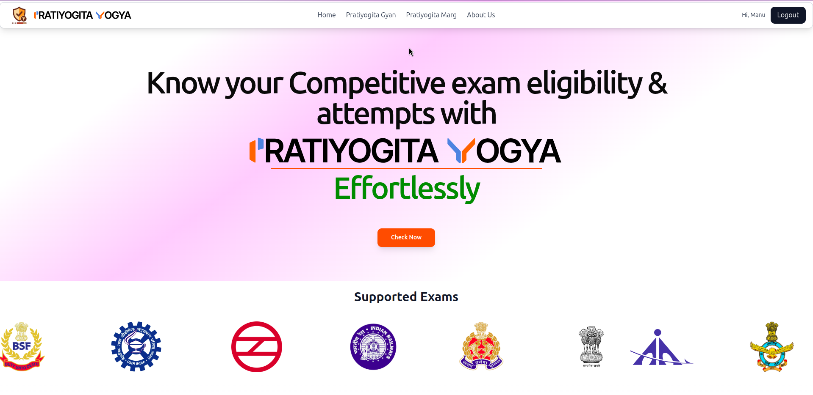
**Eligibility Checker Interface** - Enter your educational qualifications, age, and category. The system will instantly check against hundreds of competitive exams and show you every opportunity you're qualified for.

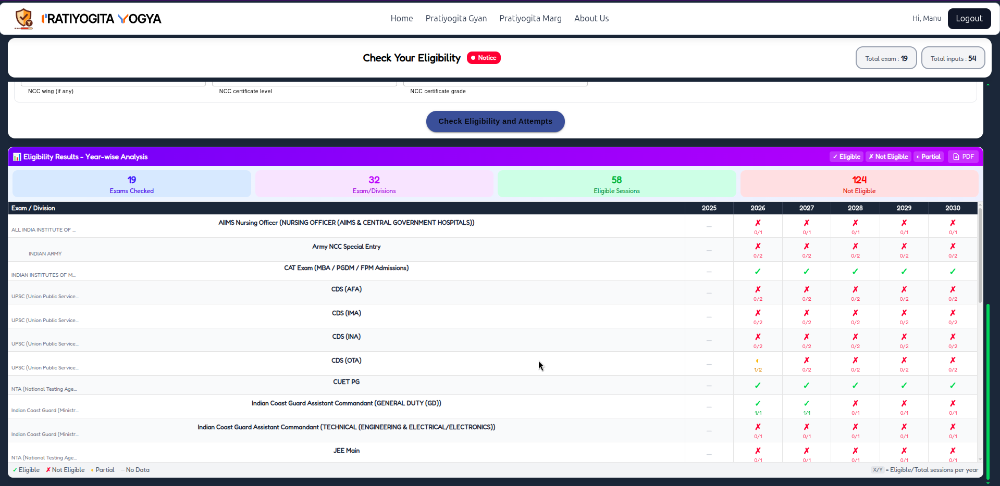
**Your Eligible Exams** - Get a comprehensive list of all exams you can apply for. Each result shows exam details, eligibility criteria matched, and application information. No more missing opportunities because you didn't know you were eligible.

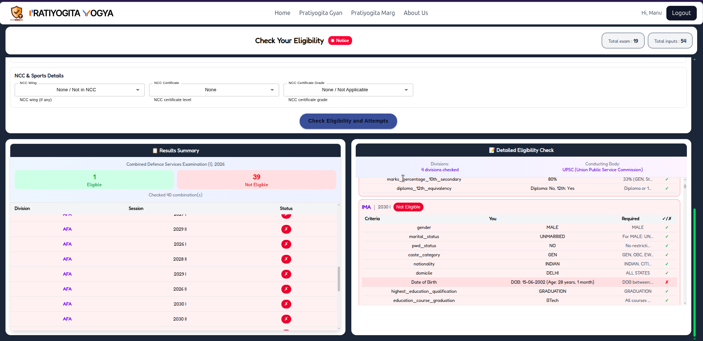
**Detailed Exam Information** - Click on any exam to see complete details including exam pattern, syllabus overview, important dates, and official application links. Everything you need to make informed decisions.

---

### 2. Pratiyogita Marg - Plan Your Preparation

Second step: Get a clear roadmap for the exam you choose.

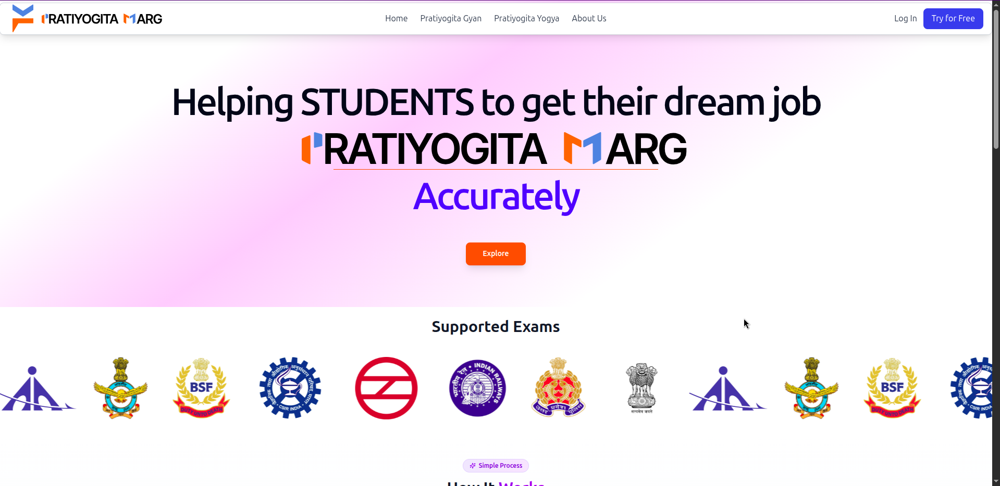
**Preparation Roadmap Platform** - Visual, interactive roadmaps showing the complete preparation journey. See the big picture of what you need to study, in what order, and how topics connect to each other.

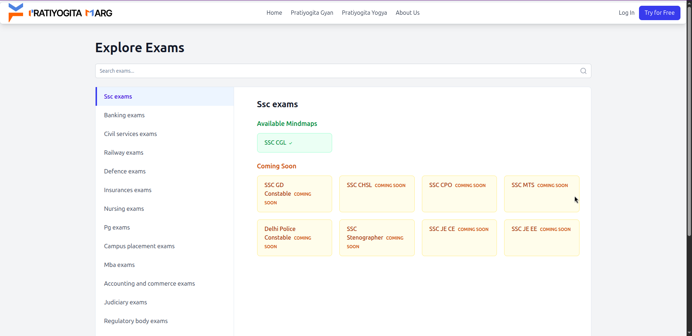
**All Available Roadmaps** - Browse roadmaps for different competitive exams. Each roadmap is crafted based on previous year analysis and expert guidance. Topics are marked as VVI (Very Very Important) or VI (Very Important) so you know where to focus your energy.

---

### 3. Pratiyogita Gyan - Study Smart with AI

Third step: Actually study with AI assistance and practice questions.

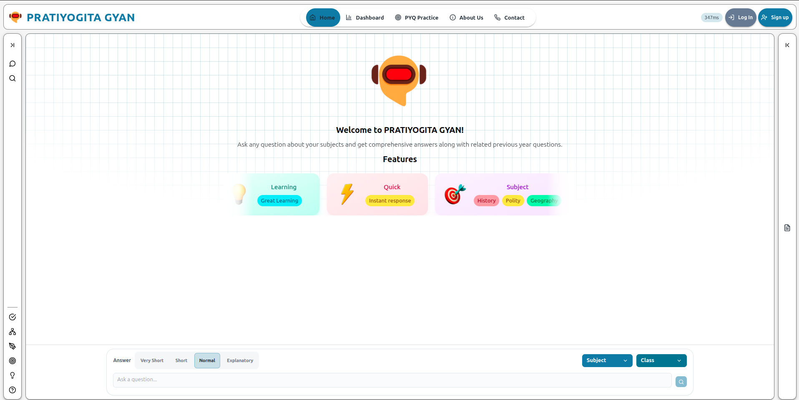
**Welcome to AI Study Assistant** - Clean, intuitive interface that gives you access to chat, PYQ practice, quizzes, and your personal dashboard. Everything organized for efficient studying.

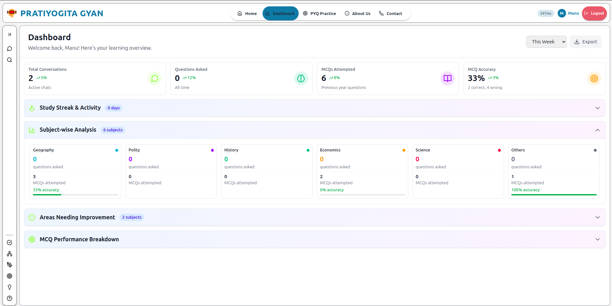
**Performance Dashboard** - Track your study time, question accuracy, weak topics, and overall progress. See detailed analytics broken down by subject and topic. Know exactly where you stand in your preparation.

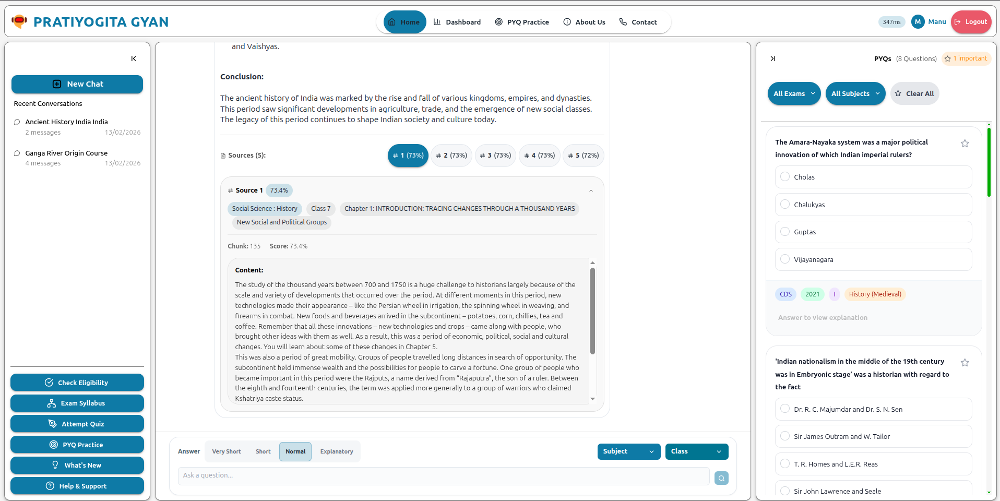
**Smart Navigation with Chat History** - All your previous conversations saved and organized. Click on any past chat to continue where you left off. Easy access to all platform features from the sidebar.

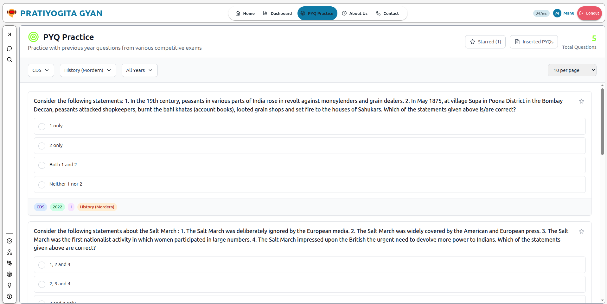
**Previous Year Questions Practice** - Thousands of real PYQ from UPSC, SSC, Banking, Railway exams. Practice mode with instant feedback and detailed explanations for every question. Learn not just the answer, but the concept behind it.

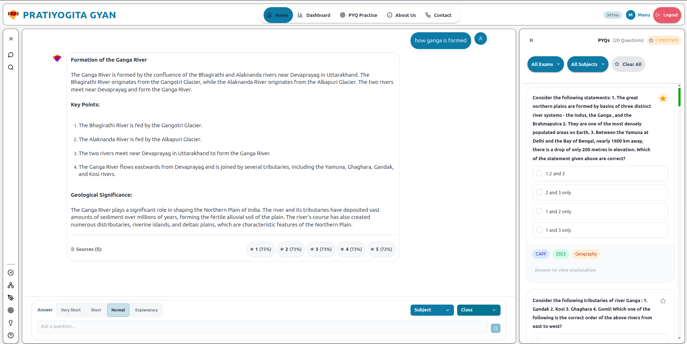
**Organized Question Bank** - Questions neatly categorized by exam type, subject, year, and difficulty. Filter to find exactly what you need to practice. Track which questions you've attempted.

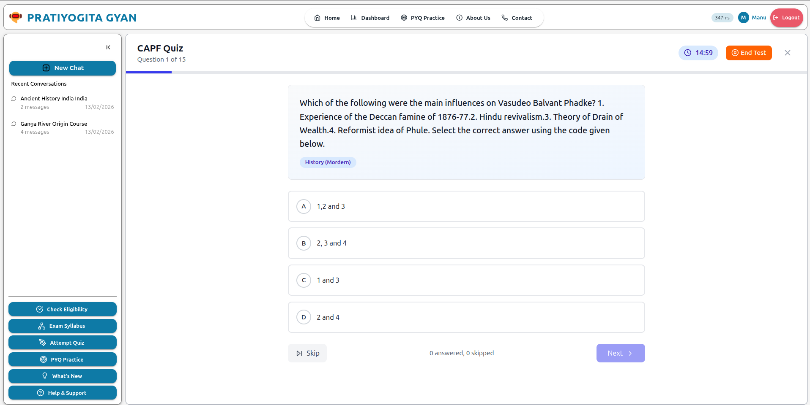
**Interactive Quizzes** - Test yourself with timed quizzes. Choose subjects, set time limits, and get instant scoring. See detailed explanations for every question after submission.

---

### Mobile Experience - Study Anywhere

All three platforms work beautifully on mobile devices:

<div align="center">
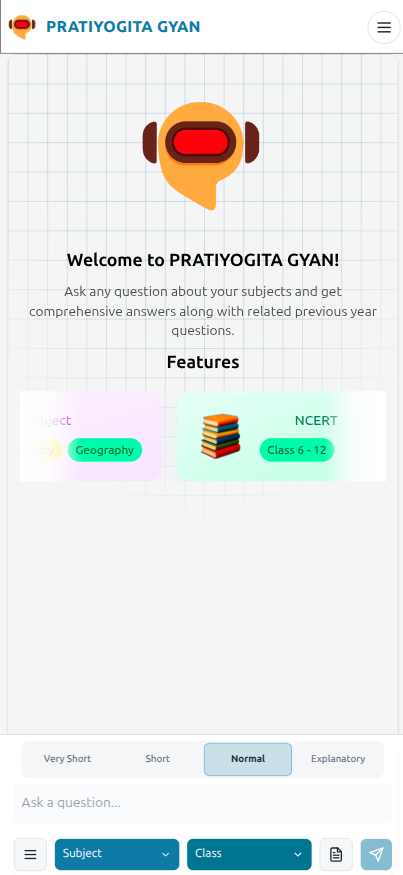
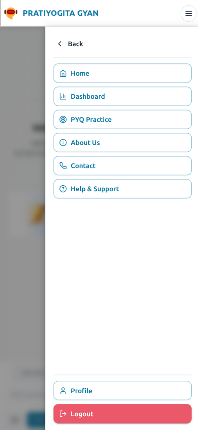
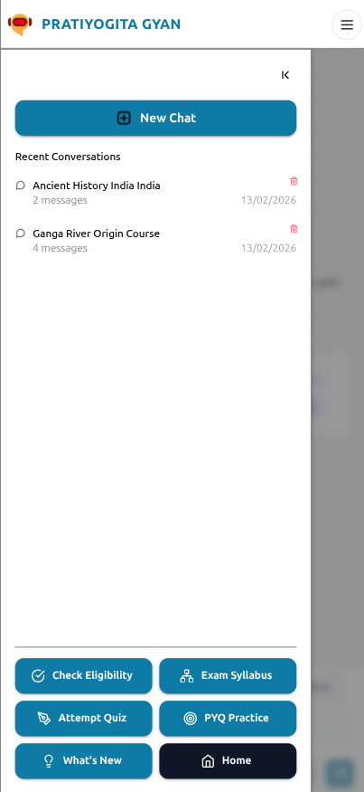
</div>

**Mobile Navigation** - User-friendly mobile interface with smooth navigation. Access all features on your phone while commuting or traveling.

<div align="center">
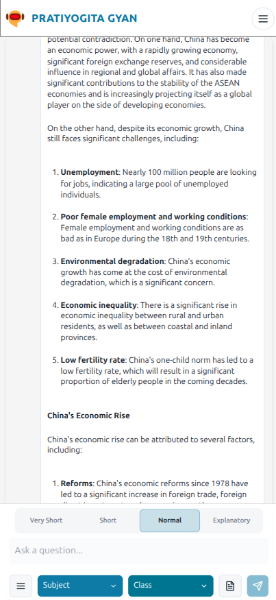
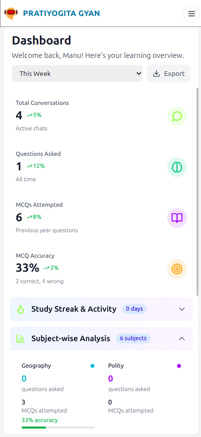
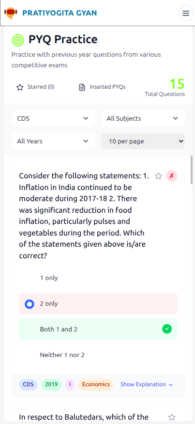
</div>

**Full-Featured Mobile Interface** - Chat with AI, view dashboard analytics, and practice PYQs - all optimized for mobile screens. Study anywhere, anytime.

<div align="center">
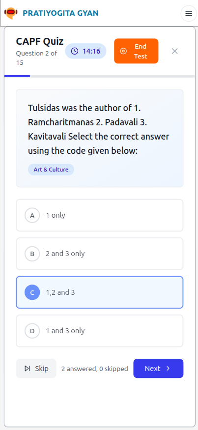
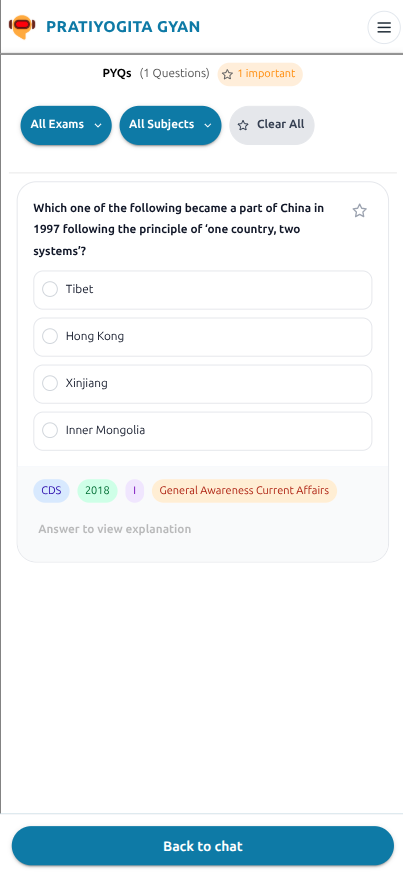
</div>

**Mobile Quiz & PYQ Practice** - Complete quiz functionality and PYQ practice on your phone. Same powerful features, perfect mobile experience.

---

## Getting Started

### What You'll Need

Before setting up the project, make sure you have:

- **Python 3.11 or higher** - Download from [python.org](https://python.org)
- **Node.js 18 or higher** - Get it from [nodejs.org](https://nodejs.org)
- **Git** - For cloning the repository
- **API Keys** - You'll need free accounts for:
  - [OpenAI](https://platform.openai.com/api-keys)/[Groq](https://groq.com) - For the AI model (Pratiyogita Gyan)
  - [Pinecone](https://pinecone.io) - For vector database (Pratiyogita Gyan)
  - [Firebase](https://firebase.google.com) - For authentication (all three apps)
- **At least 4GB RAM** - For running the applications

### Setup Instructions

Don't worry if you're new to this - we'll walk through it step by step.

1. **Get the Code**
   ```bash
   git clone https://github.com/pratiyogitasetu/chatbot.git
   cd chatbot
   ```

2. **Set Up the Backend** (Required for Pratiyogita Gyan only)
   
   The backend handles all the AI processing and database operations for the study assistant.
   
   ```bash
   cd backend
   
   # Create a virtual environment (keeps dependencies isolated)
   python -m venv venv
   source venv/bin/activate  # On Windows: venv\Scripts\activate
   
   # Install required packages
   pip install -r requirements.txt
   ```
   
   Now create a `.env` file in the backend folder with your API keys:
   ```env
   GROQ_API_KEY=your_groq_api_key_here
   PINECONE_API_KEY=your_pinecone_api_key_here
   ALLOWED_ORIGINS=http://localhost:3002
   ```

3. **Set Up Pratiyogita Yogya** (Eligibility Checker)
   
   ```bash
   cd ../pratiyogita_yogya
   
   # Install dependencies
   npm install
   ```
   
   Create a `.env` file in the pratiyogita_yogya folder:
   ```env
   VITE_FIREBASE_API_KEY=your_firebase_api_key
   VITE_FIREBASE_AUTH_DOMAIN=your-project.firebaseapp.com
   VITE_FIREBASE_PROJECT_ID=your-project-id
   VITE_FIREBASE_STORAGE_BUCKET=your-project.appspot.com
   VITE_FIREBASE_MESSAGING_SENDER_ID=your-sender-id
   VITE_FIREBASE_APP_ID=your-app-id
   ```

4. **Set Up Pratiyogita Marg** (Roadmap Planner)
   
   ```bash
   cd ../pratiyogita_marg
   
   # Install dependencies
   npm install
   ```
   
   Create a `.env` file in the pratiyogita_marg folder (same Firebase config as above):
   ```env
   VITE_FIREBASE_API_KEY=your_firebase_api_key
   VITE_FIREBASE_AUTH_DOMAIN=your-project.firebaseapp.com
   VITE_FIREBASE_PROJECT_ID=your-project-id
   VITE_FIREBASE_STORAGE_BUCKET=your-project.appspot.com
   VITE_FIREBASE_MESSAGING_SENDER_ID=your-sender-id
   VITE_FIREBASE_APP_ID=your-app-id
   ```

5. **Set Up Pratiyogita Gyan** (AI Study Assistant)
   
   ```bash
   cd ../FRONTEND
   
   # Install dependencies
   npm install
   ```
   
   Create a `.env` file in the FRONTEND folder:
   ```env
   VITE_API_BASE_URL=http://localhost:5000
   VITE_FIREBASE_API_KEY=your_firebase_api_key
   VITE_FIREBASE_AUTH_DOMAIN=your-project.firebaseapp.com
   VITE_FIREBASE_PROJECT_ID=your-project-id
   VITE_FIREBASE_STORAGE_BUCKET=your-project.appspot.com
   VITE_FIREBASE_MESSAGING_SENDER_ID=your-sender-id
   VITE_FIREBASE_APP_ID=your-app-id
   ```

6. **Start the Applications**
   
   You'll need separate terminal windows for each app you want to run:
   
   **For Pratiyogita Yogya (Eligibility):**
   ```bash
   cd pratiyogita_yogya
   npm run dev
   # Opens on http://localhost:5173 (or another port)
   ```
   
   **For Pratiyogita Marg (Roadmap):**
   ```bash
   cd pratiyogita_marg
   npm run dev
   # Opens on http://localhost:5174 (or another port)
   ```
   
   **For Pratiyogita Gyan (Study Assistant):**
   
   Terminal 1 - Backend:
   ```bash
   cd backend
   source venv/bin/activate
   python app.py
   # Runs on http://localhost:5000
   ```
   
   Terminal 2 - Frontend:
   ```bash
   cd FRONTEND
   npm run dev
   # Opens on http://localhost:3002
   ```

7. **Open Your Browser**
   
   - **Pratiyogita Yogya**: http://localhost:5173 (check eligibility)
   - **Pratiyogita Marg**: http://localhost:5174 (view roadmaps)
   - **Pratiyogita Gyan**: http://localhost:3002 (study with AI)

You can run all three together or just the ones you need!

---

## Project Structure

This is a monorepo containing four applications:

```
Pratiyogita Setu - Complete Career Preparation Ecosystem
│
├── pratiyogita_yogya/                # Eligibility Checker Application
│   ├── src/
│   │   ├── components/               # UI Components
│   │   ├── contexts/                 # State management
│   │   ├── eligibility/              # Eligibility check logic
│   │   ├── Pages/                    # Page components
│   │   └── utils/                    # Helper functions
│   ├── examsdata/                    # Exam eligibility data
│   │   ├── allexamnames.json
│   │   ├── possiblefields.json
│   │   └── *_ED/                     # Exam-specific data folders
│   ├── scripts/                      # Data upload scripts
│   ├── package.json
│   └── vite.config.js
│
├── pratiyogita_marg/                 # Roadmap Planner Application
│   ├── src/
│   │   ├── components/               # UI Components (TypeScript)
│   │   ├── contexts/                 # State management
│   │   ├── pages/                    # Page components
│   │   ├── data/                     # Roadmap data
│   │   ├── hooks/                    # Custom React hooks
│   │   └── lib/                      # Utility libraries
│   ├── package.json
│   ├── tsconfig.json                 # TypeScript config
│   └── vite.config.ts
│
├── FRONTEND/                         # Pratiyogita Gyan - AI Study Assistant
│   ├── src/
│   │   ├── components/               # UI Components
│   │   │   ├── ChatSection.jsx       # Main chat interface with AI
│   │   │   ├── AuthModal.jsx         # Login/Signup modal
│   │   │   ├── Dashboard.jsx         # Analytics dashboard
│   │   │   ├── Sidebar.jsx           # Navigation & chat history
│   │   │   ├── PYQSection.jsx        # PYQ interface
│   │   │   ├── PYQPractice.jsx       # Interactive practice mode
│   │   │   ├── QuizSection.jsx       # Quiz features
│   │   │   ├── AttemptQuiz.jsx       # Quiz attempt interface
│   │   │   └── ... (other components)
│   │   ├── contexts/                 # State Management
│   │   │   ├── AuthContext.jsx       # User authentication
│   │   │   ├── ThemeContext.jsx      # Dark/Light mode
│   │   │   └── DashboardContext.jsx  # Dashboard data
│   │   ├── config/
│   │   │   └── firebase.js           # Firebase setup
│   │   ├── services/
│   │   │   └── api.js                # Backend API calls
│   │   └── utils/                    # Helper functions
│   ├── public/                       # Static files
│   │   ├── sw.js                     # Service worker (PWA)
│   │   └── offline.html              # Offline page
│   ├── package.json
│   ├── vite.config.js
│   └── tailwind.config.js
│
├── backend/                          # Flask API (For Pratiyogita Gyan)
│   ├── app.py                        # Main Flask application with RAG
│   ├── requirements.txt              # Python dependencies
│   ├── Procfile                      # Deployment config
│   └── .env                          # API keys (create this)
│
└── SCREENSHOTS/                      # Application screenshots
    ├── pratiyogita_yogya_*.png       # Eligibility checker screenshots
    ├── pratiyogita_marg_*.png        # Roadmap planner screenshots
    └── pratiyogita_gyan_*.png        # Study assistant screenshots
```


---

## Features in Detail

### 1. Pratiyogita Yogya - Eligibility Checker

**The Problem:** Students often miss exam opportunities because they don't know they're eligible, or waste time applying for exams they don't qualify for.

**The Solution:** Enter your details once, get instant results for various exams you're eligible for.

**How it works:**
1. Fill in your educational qualifications (10th, 12th, Graduation, Post-Graduation)
2. Enter your age and category (General/OBC/SC/ST)
3. System checks against comprehensive database of exam criteria
4. Get complete list of eligible exams across:
   - UPSC (Civil Services, CDS, CAPF, etc.)
   - SSC (CGL, CHSL, JE, Stenographer, etc.)
   - Banking (IBPS PO, Clerk, SBI, RBI, NABARD, etc.)
   - Railway (RRB NTPC, Group D, ALP, JE, etc.)
   - Defense (NDA, CDS, AFCAT, Navy, Army, etc.)
   - State PSC exams
   - And many more...

**Features:**
- Division-based and non-division based exam categorization
- Detailed exam information including pattern, syllabus overview, and important dates
- Direct links to official application portals
- Export results as PDF for future reference
- Mobile-responsive for checking on any device

**Why it matters:** No more missed opportunities. No more wasted time on exams you don't qualify for. Make informed career decisions.

---

### 2. Pratiyogita Marg - Preparation Roadmap

**The Problem:** You know which exam to take, but the syllabus is overwhelming. What to study first? Which topics are most important?

**The Solution:** Clear visual roadmaps showing the complete preparation path with topics marked by importance.

**How it works:**
1. Select the exam you're preparing for
2. View interactive roadmap showing all topics and how they connect
3. Topics marked as:
   - **VVI (Very Very Important)** - Asked frequently, high weightage
   - **VI (Very Important)** - Regular appearance in exams
   - **Standard** - Important for complete preparation
4. Follow the suggested study sequence
5. Export roadmap as PDF for offline reference

**Features:**
- Visual, flowchart-style roadmaps (built with XYFlow)
- Based on previous year paper analysis
- Exam-specific preparation strategies
- Topic interconnections showing prerequisites
- Clear study path from basics to advanced
- Mobile and desktop optimized viewing

**Why it matters:** Stop feeling lost. Know exactly what to study, in what order, and what deserves most of your time. Study smart, not just hard.

---

### 3. Pratiyogita Gyan - AI Study Assistant

**The Problem:** Traditional study methods are passive. You have questions but no one to ask. You practice questions but don't understand the concepts.

**The Solution:** An AI tutor that actually knows the material, shows sources, and integrates PYQs with every answer.

#### AI Chat with RAG Technology

The heart of the platform is the intelligent chat system. Unlike generic AI chatbots, this system:

1. Converts your question into a semantic vector (mathematical representation)
2. Searches through thousands of NCERT pages and PYQ explanations using Pinecone
3. Retrieves relevant content (this is the "Retrieval" part of RAG)
4. Sends that specific content + your question to Groq's Llama 3.1 70B model
5. AI generates answer using only the retrieved content ("Augmented Generation")
6. You get accurate response with source citations

**This means:**
- AI can't hallucinate or make things up - it uses only your study material
- Every answer includes source references (which NCERT chapter/page)
- Relevant PYQs are shown with each answer
- You can verify information yourself

**What you can do:**
- Ask any question related to NCERT content (Classes 6-12)
- Get explanations for complex topics with examples
- Request real-world applications of concepts
- Have follow-up conversations where AI remembers context
- See which textbook page the answer came from
- Get related PYQs automatically with each answer

**Example queries:**
```
"Explain the concept of GDP and how it's calculated in India"
"What are the major rivers in India and their tributaries?"
"Tell me about the Preamble of Indian Constitution"
"How does photosynthesis work? Explain light and dark reactions"
"What is the difference between climate and weather?"
```

#### Integrated PYQ System

This is where it gets really powerful - PYQs aren't separate, they're integrated:

- Ask any question → Get AI answer → See related PYQs automatically
- Practice mode with thousands of questions from:
  - UPSC (Civil Services, CSAT, etc.)
  - SSC (CGL, CHSL, etc.)
  - Banking exams(IBPS, SBI, etc.)
  - Railway exams
  - State PSC exams

**Each question includes:**
- The correct answer
- Detailed explanation of why it's correct
- Explanation of why other options are wrong
- Related concepts you should know
- Difficulty level
- Exam and year it appeared in

**Practice Features:**
- Filter by exam type, subject, year
- Timed practice sessions
- Instant feedback with explanations
- Track which questions you've attempted
- Review mistakes with detailed solutions

#### Quiz Mode

Test yourself with structured quizzes:
- Choose specific subjects or topics
- Set your own time limits
- Get instant scoring after submission
- See detailed explanations for every question
- Track accuracy trends over time

#### Personal Dashboard

Your study analytics command center:
- Total study time (overall and per subject)
- Number of questions attempted and accuracy rate
- Subject-wise performance breakdown
- Weak topics that need more attention
- Study streak and consistency tracking
- Progress charts showing improvement over time
- Day-by-day study patterns

**Use this data to:**
- Identify which subjects need more focus
- Plan your daily/weekly study schedule
- Track improvement over weeks and months
- Stay motivated with streak tracking

#### User Features

**Authentication** - Sign in with email, Google, or GitHub. Your data syncs across all devices (phone, tablet, computer).

**Chat History** - Every conversation saved if you're logged in:
- Review topics you studied days/weeks ago
- Find that great explanation from last week
- Track your learning journey
- Share notes with study partners

**Progressive Web App** - Install on phone/desktop:
- Works like a native app
- Faster loading times
- Offline access to basic features
- No need to keep browser tab open

**Theme Options** - Light mode, dark mode, or auto. Easy on eyes during late-night study sessions.

**Responsive Design** - Same features on all devices. Study on phone during commute, continue on laptop at home.


---


### Why We Built This

Growing up in India, we saw how expensive coaching classes were creating a divide between students who could afford quality exam preparation and those who couldn't. We wanted to change that.

This platform is our attempt to democratize access to quality study materials and AI-powered learning assistance. Every student with internet access should be able to get the same quality of exam preparation, regardless of their economic background.

If this platform helps even one student achieve their dreams, it's been worth it.

---


### Coming Soon

**Voice Search** - Ask questions to Pratiyogita Gyan using your voice

**Regional Languages** - Interface in Hindi, Tamil, Telugu, and more languages across all three apps

**Native Mobile Apps** - Dedicated Android and iOS apps for all three platforms

**Collaborative Features** - Study groups, shared notes, and peer learning

**Advanced Analytics** - AI-powered weak area identification and personalized study plans

**Mock Tests** - Full-length mock exams with detailed analysis

---

**Built with care as a complete career preparation ecosystem for Indian students**

*Happy studying! May your preparation journey be smooth and your results be excellent.*

---

**MIT License** - See [LICENSE](LICENSE) file for details.

Feel free to use, modify, and distribute with attribution. Educational use is especially encouraged.

**© 2026 Pratiyogita Setu. Made with dedication for Indian students.**

</div>
